<!--
  This is your PROFILE README. It goes in a repo named exactly after your
  username (e.g. github.com/OCTOCAT/OCTOCAT) so GitHub shows it on your profile.
  Replace the ALL-CAPS placeholders. Widths 370/490 keep the portrait and info
  card the same height -- if you change the info card's H, re-match these.
-->

<table>
<tr>
<td valign="top"></td>
<td valign="top"></td>
</tr>
</table>

## Mr Sapthagiri

**Developer · Builder · Tech Enthusiast**

 

<!-- animated contribution graph, refreshed daily by the workflow -->

---

## 🆕 Latest Updates

**Binary ASCII Art Formats Added** ✨ *(Last Updated: July 13, 2026)*

In addition to the colored ASCII portrait, I've created **binary (0/1) versions** with multiple color schemes:

| Format | Description | View |
|--------|-------------|------|
| **Binary (Plain)** | Pure 0s and 1s representation | [`binary-portrait.txt`](./binary-portrait.txt) |
| **Binary (Markdown)** | GitHub-ready binary art | [`binary-portrait.md`](./binary-portrait.md) |
| **Binary (Web)** | Interactive HTML version | [`binary-portrait.html`](./binary-portrait.html) |
| **Binary SVG** | 4 color schemes available | See [`BINARY_CONVERSION_GUIDE.md`](./BINARY_CONVERSION_GUIDE.md) |

**Color Schemes:**
- 🔵 **Blue & Red** - Professional tech aesthetic
- 🟣 **Purple & Cyan** - Cyberpunk neon
- 🟠 **Orange & Purple** - Warm & energetic  
- 💚 **Green & Pink** - Classic neon retro

[📚 Full Documentation](./BINARY_CONVERSION_GUIDE.md) | [🔧 Conversion Script](./svg_to_binary_ascii.py)

